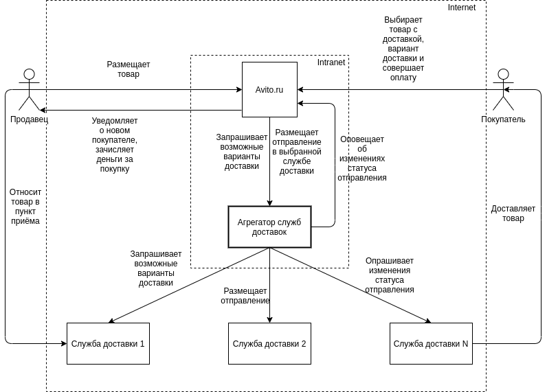
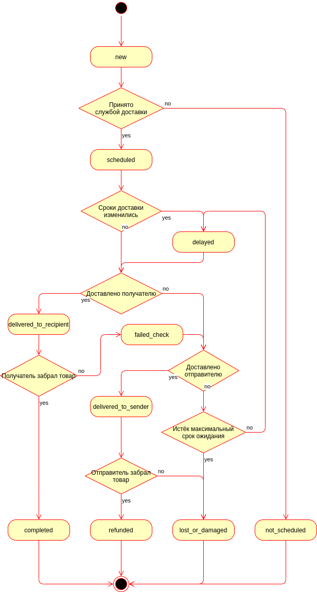
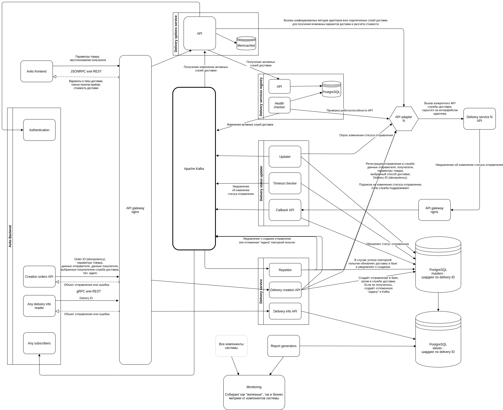

# Агрегатор служб доставок

## Цель проекта

Обеспечить возможность доставки товара от продавца к покупателю при помощи
любых сторонних логистических компаний, предоставляющих API для автоматизации.

## Глоссарий
  **Агрегатор служб доставок** (delivery agregator) — собственно, сам проектирумый сервис.
  **Служба доставки** (delivery service) — подключаемая к агрегатору логистическая компания, предоставляющая API для автоматизации (получение возможных вариантов доставки, размещение отправления, определение статуса отправления).
  **Продавец** — продавец товара в системе Авито, он же отправитель в терминах доставки.
  **Покупатель** — покупатель товара в системе Авито, он же получатель в терминах доставки.
  **Заказ** (order) — покупка в системе Авито.
  **Отправление** (delivery) — отправление заказа от продавца к покупателю при помощи выбранной покупателем службы доставки из возможных вариантов.
  **Статус отправления** — характеристика отправления из набора возможных, однозначно определяющая текущее состояние отправления.

## Требования
  1. Предоставить API для определения на основании параметров товара и местаположения продавца и покупателя:
    - возможности доставки из населённого пункта отправителя в населённый пункт получателя;
    - вариантов доставки разных типов (курьерская доставка, доставка в постомат, доставка в пункт выдачи заказов);
    - рассчёта стоимости доставки.
  2. Предоставить API для размещения отправления в подключенных службах доставки на основании выбранного покупателем варианта.
  3. Уведомлять заинтересованные сервисы о событиях, происходящих с отправлением (см. [Жизненный цикл отправления](./readme.md#Жизненный+цикл+отправления))
  4. Обеспечивать всевозможную защиту от сбоев на стороне службы доставки:
    - при невозможности создания отправления за несколько попыток отключать службу доставки;
    - при недоступности API службы доставки отключать службу доставки, при доступности — включать обратно;
    - при нарушении сроков доставки автоматически устанавливать статус "сроки доставки изменились", после истечения максимального времени ожидания переводить отправление в статус "товар потерян или поврежден".
  5. Давать возможность конфигурировать:
    - диапазоны времени проверки товаров отдельно для каждой службы доставки (если есть, по умолчанию использовать данные из API службы доставки);
    - максимальное время ожидания отправления в промежуточных статусах;
  6. Предоставлять метрики за произвольный интервал времени для каждой из служб доставки по отдельности (или всех вместе):
      - количество созданных отправлений;
      - количество отправлений, не созданных по вине службы доставки;
      - количество отправлений, не созданных по вине агрегатора;
      - количество отправлений в финальных состояниях:
        - "получатель забрал товар"
        - "товар не был принят службой доставки"
        - "товар потерян или поврежден"
        - "отправитель забрал товар"
      - количество отправлений, "подвисших" в промежуточных состояниях до истечения срока максимального ожидания.
      Для всех метрик кроме количества можно считать также и стоимость товара, чтобы лучше понимать финансовые объёмы обслуживаемых отправлений.

## Общая схема взаимодействия компонентов

## Жизненный цикл отправления

1. Cоздание отправления, статус `new`. Данные о получателе и отправителе, параметры товара и выбранного способа доставки переданы в службу доставки. Идентификатор покупки в Авито связан с идентификатором отправления на стороне службы доставки.
2. Товар был принят службой доставки, статус `scheduled`. Отправитель передал товар службе доставки.
3. ==NEW== Товар не был принят службой доставки (в т.ч. по истечении времени ожидания). ==Как нужно реагировать на такие случаи? Пытаться сделать повторную доставку? Кто понесёт расходы за неудачную или повторную попытку в случае, например, курьерской доставки?==
4. Товар был доставлен до получателя, статус `delivered_to_recipient`.
5. Получатель забрал товар (после успешной проверки), статус `completed`.
6. Получатель вернул товар службе доставки (после проверки), статус `failed_check`.
7. Товар приехал обратно к отправителю, статус `delivered_to_sender`. ==Возможно, что нужно разделять, по чьей вине товар был отправлен обратно (товар не прошёл проверку, или покупатель его вообще не забрал), чтобы понимать, нужно ли возвращать деньги за доставку покупателю?==
8. Отправитель забрал товар (убедился, что товар не был повреждён), статус `refunded`.
9. Товар потерян или поврежден, статус `lost_or_damaged`.
10. Cроки доставки изменились, статус `delayed`.

## Предполагаемая архитектура

